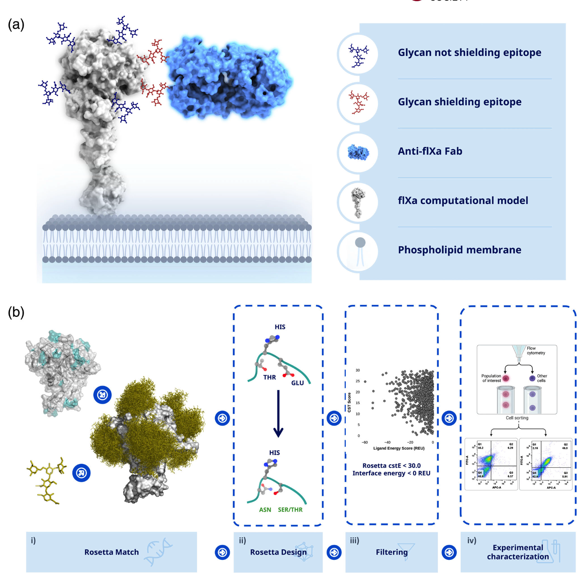

# N_Glycan_Epitope_Mapping

This repository describes the workflow for the computational modeling of glycoslylation of protein residues using Rosetta Matcher Protocol. The article is now published in Protein Science. (https://onlinelibrary.wiley.com/doi/abs/10.1002/pro.4726)

Traditional high-resolution methods like x-ray crystallography, while accurate, are limited by their low throughput and time-intensive nature, restricting their application to a small set of complexes. To address these challenges, we've pioneered a rapid computational approach. This method uniquely incorporates N-linked glycans to mask epitopes or protein interaction surfaces. This novel strategy offers an efficient mapping of these crucial regions.

Our research showcases the utility of this method using human coagulation factor IXa (fIXa) as a model system. We conducted a comprehensive computational screening of 158 positions, leading to the experimental expression of 98 variants for epitope mapping. Our approach facilitated the quick and reliable delineation of epitopes, achieved by the strategic insertion of N-linked glycans which effectively disrupt binding in a targeted manner.

To ensure the robustness of our findings, we complemented our computational predictions with empirical validation. This included conducting ELISA experiments and utilizing high-throughput yeast surface display assays. Further reinforcing our results, x-ray crystallography was employed, corroborating the coarse-grained mapping of the epitope achieved through our N-linked glycans method.

This repository contains all the relevant data, code, and resources associated with our study.

## Predict loop structure of the protein for matching

`bash path/to/N_Glycan_Epitope_Mapping/src/runDSSP.sh`

## Match for N-glycan using Rosetta Matcher

`bash path/to/N_Glycan_Epitope_Mapping/src/matcher/batch_runMatcher.sh`

## Geometrical restraint score for each match

The output files obtained from matcher protocol contains multiple glycans attached to the same amino acid position as a cluster. Therefore, it is essential to extract one glycan per PDB file. This can be achieved by running a minimization protocol at first prior to the repacking step. 

`bash path/to/N_Glycan_Epitope_Mapping/src/matcher/batch_minimMatcher.sh`

Upon completion of the minimization step, glycan and residues from the neighbourhood of glycan can be repacked to obtain better geometric constraint score and energy score. Repacking of the structure is implemented as below.

`bash path/to/N_Glycan_Epitope_Mapping/src/matcher/batch_repackMatcher.sh`
